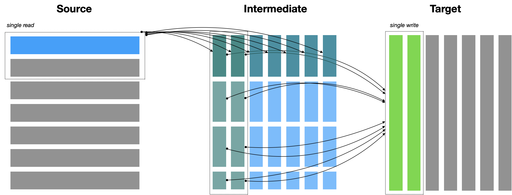

Algorithm
=========

The algorithm used by rechunker tries to satisfy several constraints simultaneously:

- *Respect memory limits.* Rechunker's algorithm guarantees that worker processes
  will not exceed a user-specified memory threshold.
- *Minimize the number of required tasks.* Specifically, for N source chunks
  and M target chunks, the number of tasks is always less than N + M.
- *Be embarrassingly parallel.* The task graph should be as simple as possible,
  to make it easy to execute using different task scheduling frameworks. This also
  means avoiding write locks, which are complex to manage, and inter-worker
  communication.

The algorithm we chose emerged via a lively disucssion on the
`Pangeo Discourse Forum <https://discourse.pangeo.io/t/best-practices-to-go-from-1000s-of-netcdf-files-to-analyses-on-a-hpc-cluster/588>`_.
We call it *Push / Pull Consolidated*.



    Visualization of the Push / Pull Consolidated algorithm for a hypothetical
    2D array. Each rectangle represents a single chunk. The dashed boxes
    indicate consolidate reads / writes.

A rough sketch of the algorithm is as follows

1. User inputs a source array with a specific shape, chunk structure and
   data type. Also specifies ```target_chunks``, the desired chunk structure
   of the output array and ``max_mem``, the maximum amount of memory
   each worker is allowed to use.
2. Determine the largest batch of data we can *write* by one worker given
   ``max_mem``. These are the ``write_chunks``.
3. Determine the largest batch of data we can *read* by one worker given
   ``max_mem``, plus the additional constraint of trying to fit within
   write chunks if possible. These are the ``read_chunks``.
4. If ``write_chunks == read chunks``, we can avoid creating an intermediate
   dataset and copy the data directly from source to target.
5. Otherwise, intermediate chunks are defined as the minimum of
   ``write_chunks`` and ``read_chunks`` along each axis. The source is copied
   first to the intermediate array and then from intermediate to target.
